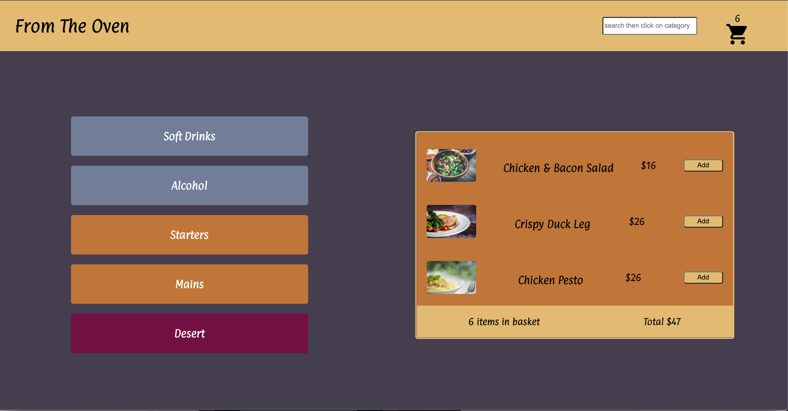
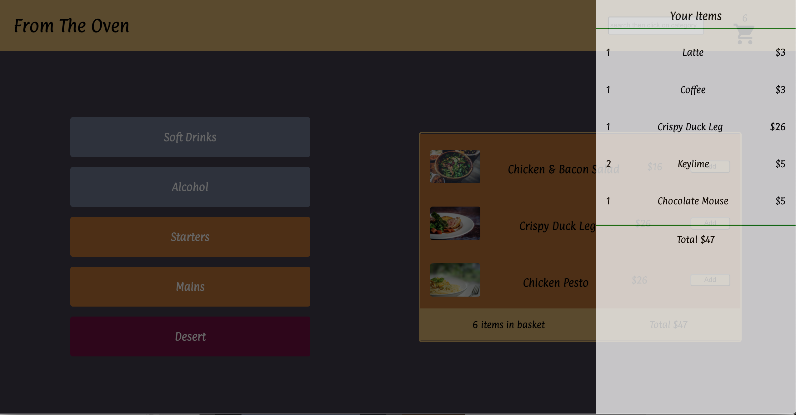

# From The Oven

 

## Deployed on [GitHub Pages](https://gentjanad.github.io/From-The-Oven/)

Purpose of this repo is to test and work with different technologies.

### App Functionality

#### A menu app that resembles online ordering venues.

    1. The user can navigate through the menu by selected category.
    2. They can select desired items and add them to the basket.
    3. They can view their order in detail on the sliding panel by clicking on the basket icon.
    4. The user can also search for a desired item and see the results in the pertaining category.

### Tech Stack

- React
- Typescript
- Figma

### Next Steps

- Refactor code using Context Api
- Continue styling
- Replace mock data with an api
